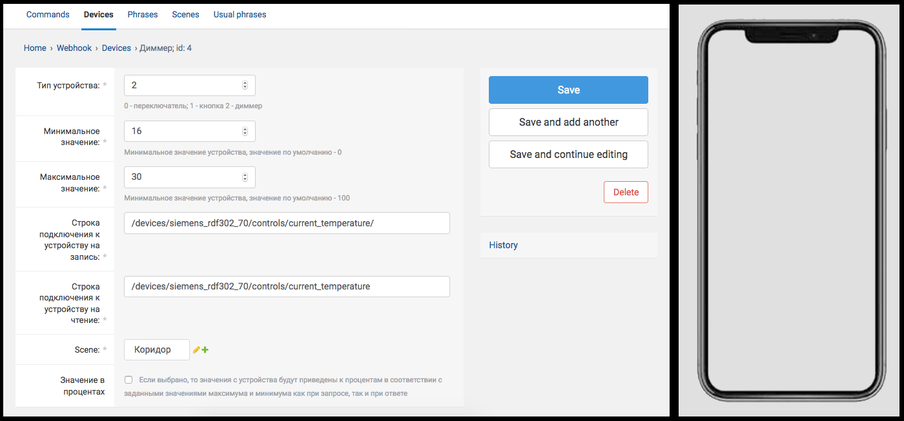

  <h1>Яндекс.Диалоги + MQTT</h1>
   
  <i>note: this project is fully in Russian as it focuses on Russian voice assistant platform</i>
   
  

    Серверная часть для создания навыка Алисы на платформе Яндекс.Диалоги для интеграции с несколькими MQTT брокерами (на примере WirenBoard)
  

  

     Django + MySQL + Paho MQTT + uWSGI + Docker
  

  

---

  
   
  
   

---

### Настройка

  Поместите файл конфигурации conf.py в app/show_room_alice/
  conf.py содержит настройку подключения к базе данных
  пример конфигурации conf.py:
  
      SECRET_KEY = 'some_secret_key' # change this asap

      # for MySQL
      DATABASES = {
        'default': {
            'ENGINE': 'django.db.backends.mysql',
            'NAME': 'db_name',
            'USER': 'db_user',
            'PASSWORD': 'db_pass',
            'HOST': '0.0.0.0' # your db ip
        }
      }
  
### Запуск

  Запуск под Docker:

        docker build -t alisa-img .
        docker run -d -p 8080:8080 -e LANG=C.UTF-8 alisa-img

### Создание навыка в Диалогах
  
  https://dialogs.yandex.ru/ -> Создать навык -> Навык в Алисе -> Backend: WebHook URL = https://your-ip.com/api/webhook
  
  Адрес API должен поддерживать HTTPS протокол, для тестирования можно воспользоваться, например, ngrok.io
  
### Лицензия

  Проект распространяется под лицензией MIT, тем не менее обратите внимание, что проект содержит библиотеку DjangoSuit      (https://djangosuit.com/), не подразумевающую коммерческого использования. Её можно заменить и DWTFUW
